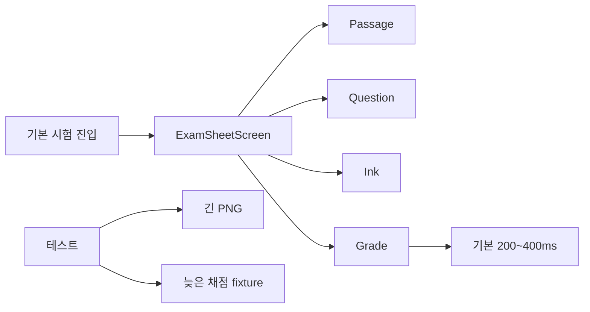

> 한장 FO가 다시 구현하는 선행 기획. InkSplit·SheetKeep 저장소 코드를 복사하지 않는다.
> 한장 경험 번호는 [experience-plan.md](./experience-plan.md) HJ-E1, HJ-E2.

# InkSplit 프로젝트 기획서

슬링 React Native. 오르조처럼 **시험지를 풀 수 있는 앱**이다.  
저장소 `inksplit` 미생성.

문제해결 쇼케이스가 아니다. 앱을 켜면 시험이 진행된다. 지문을 읽고, 밑줄 치고, 선지를 고르고, 채점하고, 고쳐서 다시 채점한다. 그 경로가 긴 지문·펜·늦은 채점에서도 같은 화면으로 남는 것이 문제해결이다.

## 기준

1. **정상 작동이 본체.** 시뮬레이터에서 시험 한 세트를 처음부터 끝까지 풀 수 있어야 한다. 스트레스 fixture를 켜지 않은 기본 실행이 제품이다.
2. **회사에 붙는다.** 지문 왼쪽 / 문항 오른쪽, 펜, 자동채점, 태블릿. 커머스·증권·채팅이면 폐기.
3. **문제해결은 그 기능 안에 있다.** 별도 “데모 모드”, 병목 토글, 테스트 전용 화면 없음.
4. **프론트 코드가 남는다.** 레이아웃, 제스처, 히트, 지문 이미지, 채점 run, variant, CI.

---

## 제품 (기본 실행)

수험생이 태블릿 가로로 국어 시험지 한 세트를 푼다.

하는 일
- 왼쪽 지문을 스크롤한다
- 펜으로 밑줄친다
- 오른쪽에서 선지를 고른다
- 채점한다. 맞/틀림이 그 선지에 붙는다
- 잘못 보냈으면 중지하고 다른 선지를 다시 채점한다

기본 데이터
- 지문 길이 평범한 1페이지
- 문항 1세트, 선지 5개
- 채점 목 서버는 200~400ms, 유실 없음

하지 않는 일
- 로그인, 결제, 실 기출, LLM 해설, 오답 목록(그건 SheetKeep)
- 실행 화면에 Delay/Drop 버튼 없음

성공 기준 (사람이 씀)
- 앱이 뜨고 지문과 선지가 보인다
- 선지를 누르면 선택된다
- 채점하면 정오가 그 선택에 붙는다
- 중지 후 다른 선지를 채점하면 새 결과만 보인다

---

## 그 안에 포함된 문제해결

기본 경로와 같은 코드다. 테스트만 극단 데이터를 넣는다.

| 기능 | 기본에서 하는 일 | 같은 코드가 막아내는 일 | 경험 |
|---|---|---|---|
| 2분할 시험지 | 지문·문항이 나란히 보임 | 긴 시험지·필기가 선지를 밀지 않음 | IS-E1 |
| 펜 | 밑줄이 지문 위에 그려짐 | 펜이 지문을 스크롤하지 않고, 선지 탭이 펜에 안 먹힘 | IS-E1 |
| 지문 이미지 | 시험지 페이지가 보임 | 긴 PNG도 보이는 타일만 decode | IS-E1 |
| 채점 | 고른 선지의 정오가 붙음 | 중지한 채점이 새 답을 덮지 않음 | IS-E2 |
| 채점 중 UI | 채점 중/완료가 보임 | 색이 아니라 variant 키 | IS-E2 |

스트레스 데이터는 `__tests__`와 mock 헤더만. 제품 엔트리에 넣지 않는다.

---

## 오르조 대응

| 오르조 | 기본 제품 | 같은 구현의 버팀 |
|---|---|---|
| 지문 왼쪽 문항 오른쪽 | 형제 ScrollView | pane-contract, 높이 비공유 |
| 스마트펜 | overlay stroke | pan vs scroll vs tap, choice-wins |
| 시험지 페이지 | 지문 PNG | 타일 decode |
| 바로 채점 | GradeRun | 늦은 JSON drop |
| 짧은 배포 | variant testID | CI |

---

## 화면

태블릿 가로 한 화면. 기본 상태 idle. 채점 중 grading. 결과는 현재 선택에만.

---

## 폴더

```
inksplit/
  src/app/App.tsx                 # 기본 시험지 진입. 데모 플래그 없음
  src/screens/exam-sheet-screen.tsx
  src/features/pane/
  src/features/ink/
  src/features/grade/
  src/features/passage-image/
  src/mock/grade-server.ts        # 기본은 짧은 지연, 성공
  contracts/pane-contract.json
  contracts/grade-run-contract.json
  fixtures/passage-normal.png     # 기본 실행
  fixtures/passage-tall.png       # 테스트만
  __tests__/
  .github/workflows/ci.yml
```

---

## 아키텍처



---

## 작업 순서

먼저 시험이 된다. 그다음 같은 경로를 극단 fixture로 잠근다.

| ID | 작업 | 종류 |
|---|---|---|
| I0 | Expo RN, Jest, CI | 기본 |
| I1 | 가로 2분할, 일반 지문·선지 표시 | 정상 작동 |
| I2 | 선지 선택 | 정상 작동 |
| I3 | 채점 성공 → 정오 표시 | 정상 작동 |
| I4 | 밑줄 그리기 | 정상 작동 |
| I5 | pane-contract, 긴 PNG·필기에도 선지 위치 유지 | IS-E1 |
| I6 | 펜 vs 스크롤 vs 선지 탭 | IS-E1 |
| I7 | 지문 타일 decode | IS-E1 |
| I8 | 중지·늦은 채점 drop + variant | IS-E2 |
| I9 | README: 앱이 하는 일 먼저, 버팀 숫자 나중 | 서류 |

I1~I4가 사람 손으로 통과하기 전에 I5~I8을 완료로 치지 않는다.

---

## 완료 기준

정상 작동
- 기본 실행으로 선택 → 채점 → 정오까지 한 사이클
- 밑줄이 지문 위에 보임
- 데모 토글 없음

문제해결 (같은 빌드)
- CI `pane-contract`, `passage-decode`, `grade-run`
- 긴 지문에도 선지 안 밀림, 선지 탭, 펜이 지문 안 밈
- 늦은 점수 0, variant 키

제외: 오르조 API, 실 기출, 펜 압력

## 스택

React Native, JavaScript, TypeScript, Android, iOS, Expo, Jest

## 구현 지시 (승인 후)

create-expo-app. I0→I4를 먼저 머지한다. 그다음 I5→I8. 테스트만 극단값. 기존 레포 복사 금지.
